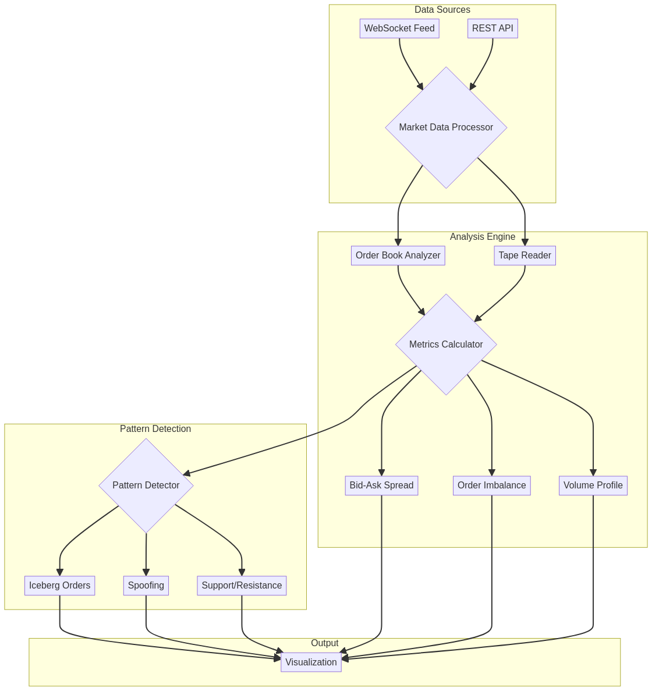

# Market Microstructure Analyzer em Rust

 

---

## 🇧🇷 Visão Geral (Português)

Uma engine de análise de microestrutura de mercado para processar e analisar dados de order book (Level 2) e fluxo de ordens (tape reading) em tempo real. Ideal para traders de alta frequência (HFT) e analistas quantitativos.

### Funcionalidades
- **Análise de Order Book:** Processamento de dados de profundidade de mercado.
- **Tape Reading:** Análise do fluxo de negócios fechados.
- **Detecção de Padrões:** Identificação de ordens iceberg, spoofing, etc.

### Arquitetura


---

## 🇺🇸 Overview (English)

A market microstructure analysis engine to process and analyze order book (Level 2) and trade flow (tape reading) data in real-time. Ideal for high-frequency traders (HFT) and quantitative analysts.

### Features
- **Order Book Analysis:** Processing of market depth data.
- **Tape Reading:** Analysis of the executed trade flow.
- **Pattern Detection:** Identification of iceberg orders, spoofing, etc.

### Architecture


---

## 🚀 Getting Started

```sh
git clone https://github.com/galafis/rust-market-microstructure-analyzer.git
cd rust-market-microstructure-analyzer
cargo build --release
cargo run --release
```

## 📜 Licença (License)

MIT License - Copyright (c) 2025 Gabriel Demetrios Lafis
